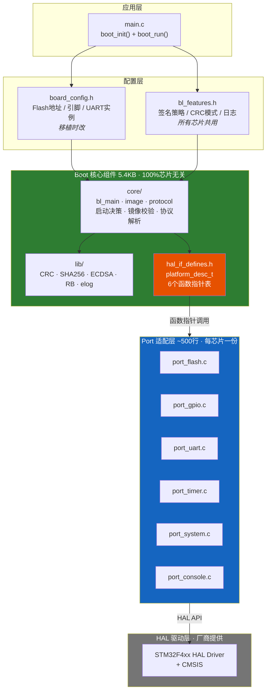
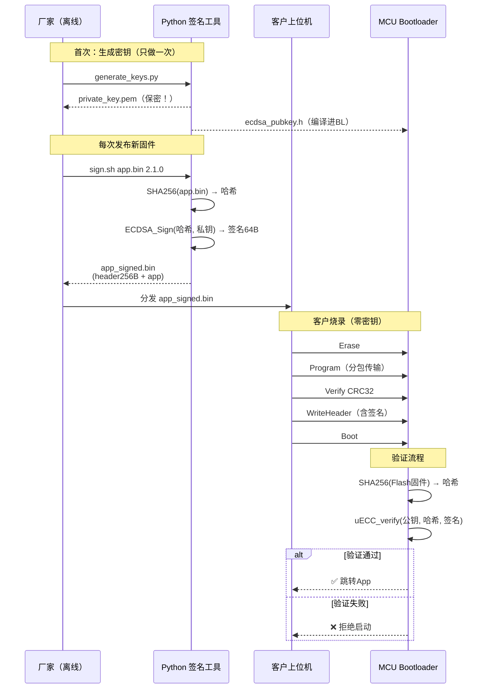
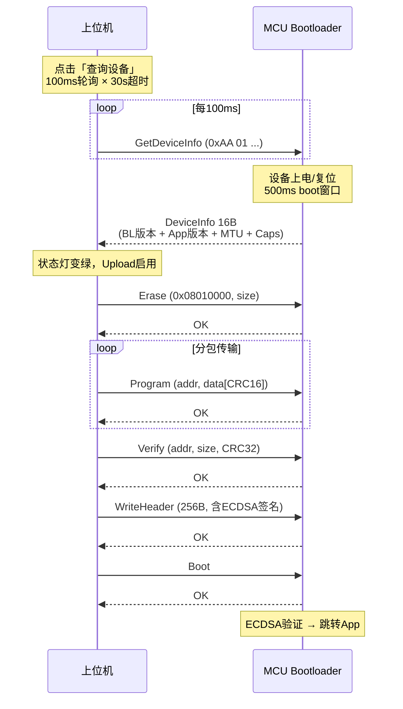

# 架构图（Mermaid 格式 + 面试白板速画）

本文件包含 4 张图的源码，可以直接粘贴到 GitHub README（Mermaid 自动渲染），或导入 draw.io。

> 图示地址以 F407 (`0x08010000`) 为例。F103 是 `0x08006400`，其他芯片由 `device_info_t.app_base` 动态决定。

---


## 图 1：系统架构图（4 层）

### Mermaid（GitHub README 自动渲染）



---

## 图 2：安全签名流程

### Mermaid



---

## 图 3：升级时序图

### Mermaid



---

## 图 4：体积对比图

### Mermaid 柱状图（用 markdown 表格代替）

```
体积对比 (KB)
━━━━━━━━━━━━━━━━━━━━━━━━━━━━━━━━━━━━━━━━━
MCUBoot (ARM官方)     ████████████████████████████ 32.0
你的项目 (BL_LOG=1)   █████████████████████ 23.7
你的项目 (BL_LOG=0)   ████████████████ 16.6
core + lib (纯组件)   █████ 5.4
━━━━━━━━━━━━━━━━━━━━━━━━━━━━━━━━━━━━━━━━━
```

---

## draw.io 导入方法

### 方法 1：用 draw.io 打开 Mermaid

1. 打开 https://app.diagrams.net
2. 菜单 → Arrange → Insert → Advanced → Mermaid
3. 粘贴上面的 Mermaid 代码
4. 自动生成图形，可拖拽调整位置
5. File → Export as → PNG（高清）或 SVG（矢量）

### 方法 2：从零画（更灵活）

1. 打开 https://app.diagrams.net
2. 用左侧形状库画矩形 + 箭头
3. 推荐布局：

```
┌─────────────────────────────────────────┐
│  main.c → boot_init() + boot_run()     │  ← 顶部：入口
├─────────────────────────────────────────┤
│  board_config.h    │  bl_features.h     │  ← 配置层
│  (芯片相关)         │  (业务相关)        │
├─────────────────────────────────────────┤
│                                         │
│  ┌──────────┐  ┌──────────┐           │
│  │  core/   │  │  lib/    │  5.4KB    │  ← 核心（绿色框）
│  │ 业务逻辑  │  │ 算法库   │  100%无关 │
│  └──────────┘  └──────────┘           │
│                                         │
│  ┌─────────────────────────────────┐   │
│  │  hal_if_defines.h               │   │
│  │  platform_desc_t (函数指针表)    │   │  ← 接口（橙色框）
│  └─────────────────────────────────┘   │
│                                         │
├─────────────────────────────────────────┤
│                                         │
│  ┌────────┐┌────────┐┌────────┐       │
│  │flash   ││gpio    ││uart    │       │
│  └────────┘└────────┘└────────┘       │  ← Port（蓝色框）
│  ┌────────┐┌────────┐┌────────┐       │
│  │timer   ││system  ││console │       │
│  └────────┘└────────┘└────────┘       │
│             ~500 行                    │
│                                         │
├─────────────────────────────────────────┤
│  STM32 HAL Driver + CMSIS               │  ← 底部：灰色
└─────────────────────────────────────────┘
```

配色建议：
- 核心层：绿色 `#4CAF50`
- 接口层：橙色 `#FF9800`
- Port 层：蓝色 `#2196F3`
- HAL 层：灰色 `#757575`

### 方法 3：Excalidraw（手绘风格，适合 README）

1. 打开 https://excalidraw.com
2. 手动画框 + 箭头
3. 导出 PNG/SVG

---

## 面试白板速画版（30 秒画完）

```
    ┌─────────────┐
    │  main.c     │  boot_init + boot_run
    ├──────┬──────┤
    │board │feat  │  配置
    ├──────┴──────┤
    │   core+lib  │  5.4KB 不用改 ← 画个圈强调
    │   (函数指针)  │
    ├──────┬──────┤
    │ port │6文件 │  ~500行 移植时写
    ├──────┴──────┤
    │  HAL Driver │  厂商的
    └─────────────┘
```

**30 秒话术**：
> "4 层架构，中间这块是核心，5.4KB，完全不碰硬件，通过函数指针调下面。移植时只换最下面两层。"
